# AWS Bedrock Enterprise RAG 🧠

Reference architecture for enterprise **Generative AI**, using **AWS Bedrock (Titan)**, **LangChain**, and **Vector Search**.

## Architecture
This project implements the **RAG (Retrieval-Augmented Generation)** pattern with a focus on stability and control.

```mermaid
graph TD
    User[Usuário / Client] -->|POST /ask| API[FastAPI Async]
    API -->|Orquestração| Chain[LangChain RAG]
    
    subgraph "Retrieval Layer (Memória)"
        Chain -->|Query| VectorDB[(FAISS Local)]
        VectorDB -->|Contexto Relevante| Chain
    end
    
    subgraph "Generative Layer (AWS Bedrock)"
        Chain -->|Prompt + Contexto| Wrapper[Custom TitanLLM Wrapper]
        Wrapper -->|Boto3 Invoke| Bedrock[AWS Bedrock API]
        Bedrock -.->|Titan Embeddings| VectorDB
        Bedrock -->|Titan Text Express| Wrapper
    end
    
    Wrapper -->|Resposta Gerada| API
    API -->|JSON| User
```


- **LLM Engine:** AWS Bedrock (Amazon Titan Text Express)
- **Embeddings:** AWS Bedrock (Amazon Titan Embeddings)
- **Custom Wrapper:** Custom implementation (`TitanLLM`) for granular control of the AWS payload via Boto3.
- **Orchestration:** LangChain LCEL & Pydantic v2
- **Vector Store:** FAISS (Local)
- **API:** FastAPI (Async)

## 🛠️ Engineering Solution: Custom Titan Wrapper
During development, an inconsistency was identified in the JSON formatting of the standard libraries for the Titan model.

A custom class `TitanLLM` was developed that inherits from `LLM` to ensure the correct injection of `textGenerationConfig` parameters via the `boto3` SDK.

## How to Run
1. Configure the AWS credentials in `.env` (Region: us-east-1).

2. Install dependencies:
   ```bash
   pip install -r requirements.txt
Inject the data (Vector ETL):

bash

python scripts/ingest_data.py
Start the API:

bash

python app/main.py
📚 Technology Stack
Python 3.10+

AWS SDK (Boto3)

FastAPI

LangChain Core/Community

FAISS (Facebook AI Similarity Search)


#### 3. Git Commands
In the terminal (project root):

```powershell
git add .
git commit -m "feat: implement custom TitanLLM wrapper to fix bedrock payload issues"
git push origin master
